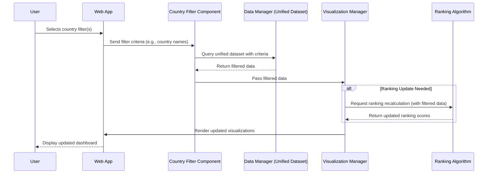
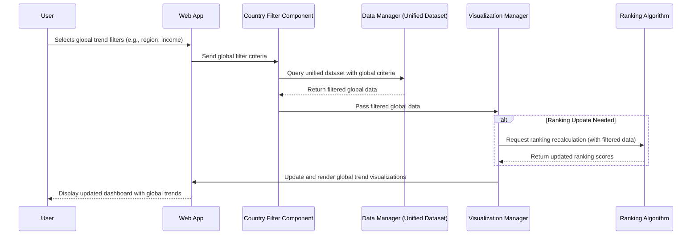

# Component Specification

## Software Components

### 1. Data Manager (Unified Dataset)
**What it does:**  
Provides a simplified interface to the unified dataset that merges data from multiple sources using the common "Country" and "Year" field. It handles data cleaning, integration, and efficient querying.

**Inputs:**  
- Raw data files (e.g., IHME data, WHO Global Health Workforce data)  
- Query parameters (e.g., selected countries, filtering criteria)

**Outputs:**  
- A filtered subset of the unified dataset  
- Aggregated metrics for visualization and ranking

---

### 2. Visualization Manager
**What it does:**  
Renders data frames as interactive plots and graphs. It updates visualizations in real time based on user interactions and the filtered data provided by other components.

**Inputs:**  
- Filtered data (from the Country Filter Component via the Data Manager)  
- User interaction parameters (e.g., selected chart type, additional filter options)

**Outputs:**  
- Interactive visualizations (charts, graphs, dashboards)  
- Data summaries accompanying the visuals

---

### 3. Country Filter Component
**What it does:**  
Manages filtering by country (or multiple countries) as specified by the user. It acts as the intermediary that passes filter criteria to the Data Manager and sends the resulting data to the Visualization Manager.

**Inputs:**  
- User-selected country names or regions  
- Unified dataset (accessed via the Data Manager)

**Outputs:**  
- A subset of the unified dataset corresponding to the selected countries  
- Filtered data forwarded to the Visualization Manager

---

### Additional Components (Optional)

#### 4. Ranking Algorithm
**What it does:**  
Calculates numerical scores to rank countries based on various healthcare indicators and normalized metrics.

**Inputs:**  
- Healthcare indicators from the filtered or complete dataset  
- Predefined weights and parameters for the ranking formula

**Outputs:**  
- Ranking scores (numerical values reflecting healthcare performance)

---

#### 5. Web App Interface
**What it does:**  
Acts as the user entry point, capturing user inputs and orchestrating interactions among the backend components. It displays the final visualizations and any export/download options.

**Inputs:**  
- User interactions (e.g., country selection, filter adjustments)  
- Processed data and visualizations from the Visualization Manager

**Outputs:**  
- Updated dashboard views  
- Interactive visual feedback and export options

---

## Interactions to Accomplish Use Cases

### Use Case 1: Exploring a Specific Country's Healthcare

**Scenario:**  
A policymaker or interested user selects a specific country (or multiple countries) to view detailed healthcare data.

**Interaction Flow:**
1. **User Action:**  
   The user selects one or more countries via the Web App Interface.
2. **Filtering:**  
   The Web App sends the selected criteria to the Country Filter Component.
3. **Data Query:**  
   The Country Filter Component queries the Data Manager for the corresponding data subset.
4. **Data Processing:**  
   The Data Manager returns the filtered dataset.
5. **Visualization:**  
   The Country Filter Component passes the filtered data to the Visualization Manager, which updates the visualizations. If necessary, it invokes the Ranking Algorithm to update scores.
6. **Display:**  
   The updated dashboard is rendered on the Web App for the user.

#### Sequence Diagram for Use Case 1

## Use Case 2: Comparing Quality of Life Across Countries

**Scenario:**  
A person looking to move countries want to see which countries have the highest rated healthcare outcomes.

**Interaction Flow:**
1. **User Action:** The user selects global trend filters via the Web App.
2. **Filtering:** The Web App sends these criteria to the Country Filter Component.
3. **Data Query:** The Country Filter Component queries the Data Manager using the global filter criteria.
4. **Data Processing:** The Data Manager returns the filtered global dataset.
5. **Visualization:** The Country Filter Component passes the filtered global data to the Visualization Manager, which updates the visualizations. Optionally, the Ranking Algorithm is invoked.
6. **Display:** The updated dashboard displays the global trends across various countries.

### Sequence Diagram for Use Case 2

## Use Case 3: Exploring Global Healthcare Trends

**Scenario:**  
A journalist or global health analyst applies various filters (e.g., region, income level) via the Web App to explore and compare global healthcare trends.

**Interaction Flow:**
1. **User Action:** The user selects global trend filters via the Web App.
2. **Filtering:** The Web App sends these criteria to the Country Filter Component.
3. **Data Query:** The Country Filter Component queries the Data Manager using the global filter criteria.
4. **Data Processing:** The Data Manager returns the filtered global dataset.
5. **Visualization:** The Country Filter Component passes the filtered global data to the Visualization Manager, which updates the visualizations. Optionally, the Ranking Algorithm is invoked.
6. **Display:** The updated dashboard displays the global trends across various countries.

### Sequence Diagram for Use Case 3

