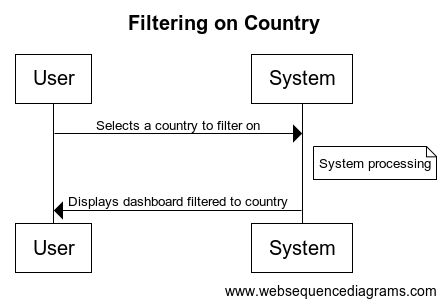

# Component Spec

**Component 1: Country Filter on Visualization**

What it does: Filters for one or multiple countries and updates views to reflect it

Inputs: Countries to filter on, data, visualizations

    displayVisual(data, filters={}):

        if there are countries in filter, then filter df to only those

        build visual using the filtered df
        
        show visual

