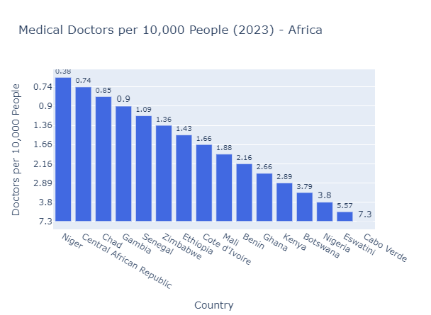
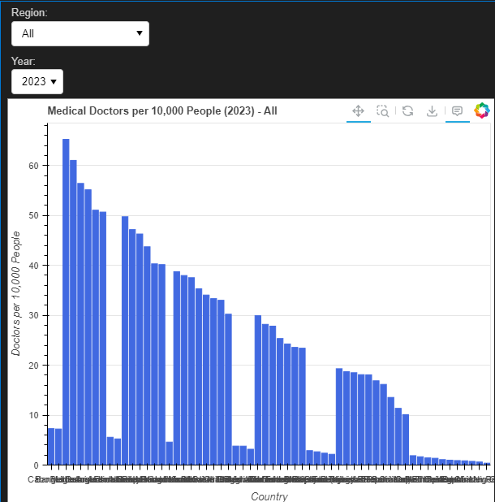

# Technology Review

## **Background**

The problem we are trying to solve is displaying visuals of the data in a dashboard format. These visuals should be easy to use, interactive, and visually appealing. This will be needed for use cases where the user is viewing data and using filters to adjust the visuals for their needs. We want it to be compatible with a web interface.

## **Python Libraries**

**Plotly** - Plotly is a python library for creating interactive visuals. It can be used in Jupyter Notebooks and it integrates well with Dash for building interactive dashboards. Plotly is user friendly and builds plots with minimal code. 

Author: Plotly (Alex Johnson, Jack Parmer, Chris Parmer, Matthew Sundquist)

**Bokeh** - Bokeh is a python library for creating interactive visuals. It is more suited for large datasets and web applications. There is a lot of flexibility for styling and interactivity. It integrates well with Flask and Django for web apps. 

Author: Bokeh (Bryan Van de Ven, Isaiah Akorita, Demetris Roumis, PhD)

## **Technology Comparison**

**Plotly**

**Bokeh** 

## **Final Choice:** Plotly
We finally chose Plotly because of its compatibility with Dash and Streamlit, both of which we are considering using for setting up the dashboard. Potential drawbacks of using Plotly are, since part of the reason we chose it was based on its compatibility with web apps we are considering using, if we decide to go another route with the web app we will have to make sure that Plotly is easily integrated to this app. Plotly uses JavaScript for rendering, which processes visualizations on the user’s device rather than the server, making dashboards slower and less responsive, especially when handling complex interactions or large datasets.